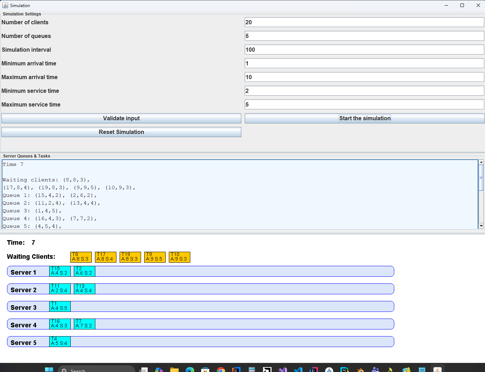

# Queue Management System

**Queue Management System** is a Java-based application designed to provide a graphical interface for managing and visualizing the flow of clients in real-time. The core objective is to **minimize the average waiting time for clients** by dynamically assigning tasks across multiple parallel servers.

---

### Features

#### Real-Time Visualization
* **Graphical Interface (GUI)**: Built for managing and visualizing queues, clients, and tasks across multiple servers.
* **Dynamic Monitoring**: Provides real-time updates of queue lengths and server activities as the simulation progresses.

#### Task Scheduling & Strategy
* **Efficiency Optimization**: Automatically assigns each client to the queue with the minimum waiting time to ensure the most efficient service delivery.
* **Dynamic Distribution**: Tasks are scheduled dynamically to servers based on their availability and current workload.

#### Multithreaded Simulation
* **Thread-per-Queue**: Each service queue operates on its own independent thread to process tasks concurrently.
* **Simulation Engine**: A primary simulation thread handles the global clock and manages the arrival of $N$ generated clients.
* **Log of Events**: Generates a detailed event history in a `.txt` file, tracking the status of every client and queue.

#### Configurable Parameters
Users can customize the simulation setup directly through the interface:
* Number of clients ($N$)
* Number of servers/queues ($Q$)
* Total simulation interval ($t_{simulation}$)
* [cite_start]Minimum and maximum bounds for arrival and service times[cite: 1].

---

---
### Technologies Used

#### Backend – Java
* **Multi-threading Support**: Utilizes Java threads and synchronization mechanisms for handling concurrent client tasks safely.
* **Thread-Safe Data Structures**: Uses appropriate synchronized structures (e.g., `BlockingQueue`) to prevent race conditions.
* **Object-Oriented Design**: Built for scalability and modularity following Java naming conventions.

#### Frontend – Java Swing
* **Interactive Interface**: Developed using Java Swing to allow user input and real-time visualization.
* **Cross-platform Support**: Leverages Java's portability for consistent performance across different operating systems.

---

### Performance Metrics
At the end of each simulation, the system computes and displays key performance indicators:
* **Average Waiting Time**: The mean time spent by clients waiting in queues.
* **Average Service Time**: The average duration required to serve a client.
* **Peak Hour**: Identifies the simulation interval with the highest number of active clients.

---

### Testing Scenarios
The system has been validated using the following mandatory input data sets:
1. **Test 1**: N=4 clients, Q=2 queues
2. **Test 2**: N=50 clients, Q=5 queues
3. **Test 3**: N=1000 clients, Q=20 queues
